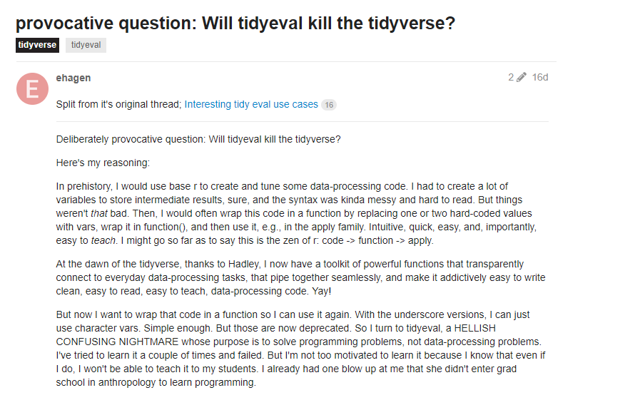

# The pipe and verbs

```{r, include = FALSE}
titanic <- read.csv("C:/Users/kbodwin/Dropbox/Teaching/331/Data/titanic.csv")
library(tidyverse)
library(lubridate)
```


## The pipe

Suppose I have a dataset called `titanic`, and I want to see the first two rows.  The following are equivalent:

```{r}
head(titanic, 2)
titanic %>% head(2)
```

## The pipe

Now suppose I want to make a new variable consisting of the Fare paid, rounded to the nearest whole number:

```{r, error = TRUE}
titanic %>%
  round(Fare)
```

## The pipe

Now suppose I want to make a new variable consisting of the Fare paid, rounded to the nearest whole number:

```{r, error=TRUE}
round(titanic, Fare)
```

## The pipe

Now suppose I want to make a new variable consisting of the Fare paid, rounded to the nearest whole number:

```{r, error = TRUE}
titanic %>%
  round(titanic$Fare)
```

## The pipe

Now suppose I want to make a new variable consisting of the Fare paid, rounded to the nearest whole number:

```{r, error=TRUE}
round(titanic, titanic$Fare)
```

---> No $ or [] in the Tidyverse!

## The pipe

Now suppose I want to make a new variable consisting of the Fare paid, rounded to the nearest whole number:

```{r}
titanic %>% mutate(
  round(Fare)
) %>% select(Fare)

```

## The pipe

Now suppose I want to make a new variable consisting of the Fare paid, rounded to the nearest whole number:

```{r}
titanic %>% mutate(
  Fare = round(Fare)
) %>% select(Fare)

```

# Designing code to do the work for you

## An obvious situation

Suppose you are asked to add 1575 to 287, then divide by 16, and have R print out the answer.

```{r}

## I did this by hand on a piece of paper
ans <- 116.375
ans

```

## An obvious situation

Suppose you are asked to add 1575 to 287, then divide by 16, and have R print out the answer.

```{r}

ans <-(1575+287)/16
ans

```

## An obvious situation

Oops - I meant to say divide by 15, not 16!

```{r}

ans <-(1575+287)/15
ans

```

## A less obvious situation

Was my birthday within 35 days of Thanksgiving 2018?

```{r}
mdy("April 2, 2018") %within% 
  interval(mdy("October 14, 2018"), 
           mdy("December 23, 2018"))
```

## A less obvious situation

Oops - Thanksgiving was November 22.  I used November 18
Oops - I meant to check my brother's birthday, not my own.
Oops - I mean to look 30 days before and after, not 35.

```{r, eval = FALSE}
mdy("April 2, 2018") %within% 
  interval(mdy("October 14, 2018"), 
           mdy("December 23, 2018"))
```

... ugh, gotta start all over!

## A better solution

Was my birthday within 35 days of Thanksgiving 2018?

```{r}
my_bday <- mdy("April 2, 2018") 
tgiving <- mdy("November 18, 2018")
dist <- days(35)

my_bday %within% 
  interval(tgiving - dist, 
           tgiving + dist)
```

## A better solution

Oops - Thanksgiving was November 22.  I used November 18
Oops - I meant to check my brother's birthday, not my own.
Oops - I mean to look 30 days before and after, not 35.


```{r}
my_bday <- mdy("April 2, 2018") 
tgiving <- mdy("November 18, 2018")
dist <- days(35)

my_bday %within% 
  interval(tgiving - dist, 
           tgiving + dist)
```


## A better solution

Oops - Thanksgiving was November 22.  I used November 18
Oops - I meant to check my brother's birthday, not my own.
Oops - I mean to look 30 days before and after, not 35.

```{r}
my_bday <- mdy("November 6, 2018") 
tgiving <- mdy("November 22, 2018")
dist <- days(30)

my_bday %within% interval(tgiving - dist, tgiving + dist)
```

... Easy peasy!

# Object Types

## Object types

- What type of object you are referencing:
- A data frame
- A list
- A vector
- A variable in a dataset (so a vector)
    + Numeric?  (integer?)
    + Character?  (aka String)
    + Boolean?
    + Factor?
    + DateTime?
    
- This is important when deciding input to functions

## Object Types

```{r, eval = FALSE}
thing_1 <- "1989-04-02"
thing_2 <- 1989-04-02
thing_3 <- "April 2, 1989"
thing_4 <- April 2, 1989

class(thing_1)
class(thing_2)
class(thing_3)
class(thing_4)
```

## Object Types

```{r, error = TRUE}
thing_1 <- "1989-04-02"
thing_2 <- 1989-04-02
thing_3 <- "April 2, 1989"
thing_4 <- April 2, 1989

class(thing_1)
class(thing_2)
class(thing_3)
class(thing_4)
```

## Object Types

```{r, eval = FALSE}
thing_1 <- "1989-04-02"
thing_2 <- 1989-04-02
thing_3 <- "April 2, 1989"

ymd(thing_1)
ymd(thing_2)
mdy(thing_3)
```


## Object Types

```{r}
thing_1 <- "1989-04-02"
thing_2 <- 1989-04-02
thing_3 <- "April 2, 1989"

ymd(thing_1)
ymd(thing_2)
mdy(thing_3)
```

# To Quote or not to Quote?

## When to quote?


We (basically) never put quotes around existing object names.

```{r, error = TRUE}
bob <- 1:10
mean("bob")
```

## When to quote?


We (basically) never put quotes around existing object names.

There are exceptions to every rule...

```{r, error = TRUE}
## Base R
dat <- data.frame(bob = 1:10)
mean(dat[,"bob"])

```


## When to quote?

However, we do often use quotes to assign/change names of objects.

```{r}
dat <- data.frame(bob = 1:3)
names(dat) <- "joe"
dat
```

## When to quote?

However, we do often use quotes to assign/change names of objects.

```{r}
dat <- data.frame(bob = 1:3)

dat %>% rename("joe" = bob)
```

## When to quote?

The Tidyverse is trying to get a way from this, and also assign names to variables without quotes.

```{r}
dat <- data.frame(bob = 1:3)

dat %>% rename(joe = bob)
```

## When to quote?

The Tidyverse is trying to get a way from this, and also assign names to variables without quotes.

```{r}
dat <- data.frame(bob = 1:5, joe = 1:5)

dat %>% gather(key = name, value = num)
```

## When to quote?

(This is not without controversy...)





## When to quote?

But:  never, EVER try to reference or create *values* without quotes!!!

```{r, eval = FALSE}
bob <- c(a, b, c)
```

## When to quote?

But:  never, EVER try to reference or create *values* without quotes!!!

```{r}
bob <- c("a", "b", "c")
```

## When to quote?

Which of these should have quotes?

```{r, eval = FALSE}
titanic %>% 
  mutate(
    Expensive = Fare > 100,
    Age_Group = case_when(
      Age < 18 ~ Kid,
      Age > 18 ~ Adult
    ) 
  ) %>%
  factor(Age_Group, levels = c(Adult, Kid)) %>%
  filter(Sex == Male)
```

## When to quote?

Which of these should have quotes?

```{r, eval = FALSE}
titanic %>% 
  mutate(
    Expensive = Fare > 100,
    Age_Group = case_when(
      Age < 18 ~ "Kid",
      Age > 18 ~ "Adult"
    )
  ) %>%
  factor(Age_Group, levels = c("Adult", "Kid")) %>%
  filter(Sex == "Male")
```


# What to look out for today

## Common string mistakes

- Don't forget about punctuation, silly!
- Different types of whitespace: space, tab (\t), new line (\n), etc.
- Regular expression are a new type of object.
    + When are they used?
    + How do they work?
    + `str_view` is your friend.
- Difference between `replace`, `extract`, `match`, and `locate`
- The `_all` suffix: `str_replace` vs `str_replace_all`, etc.
    + What types of objects do they take as *input*?
    + What types of objects do they give as *output*?


