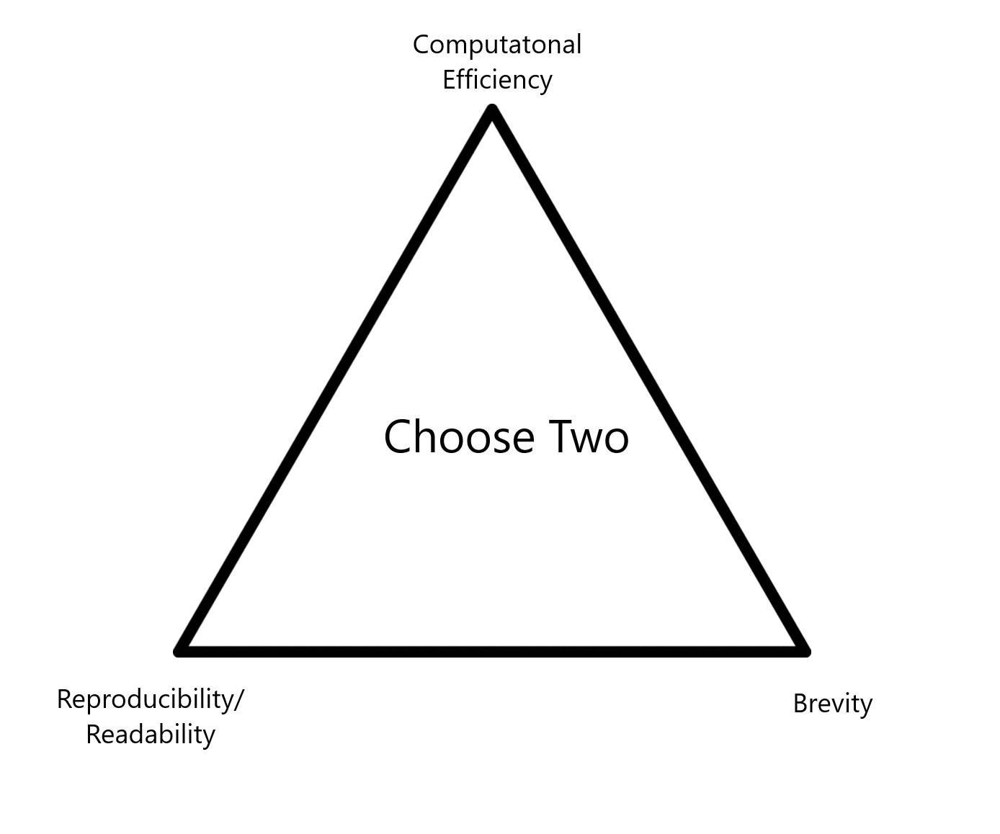
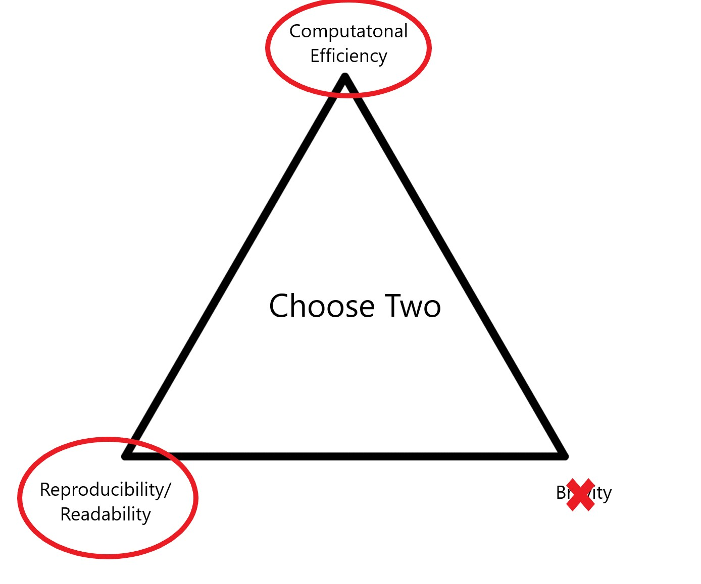

# Keyboard shortcuts

## Useful shortcuts
- Symbols
    + `Ctrl/Cmd + shift + m  =   %>%`
    + `Alt/Option + -  = <-`
<br>
- Panels
    + `Ctrl/Cmd + shift + 1`  zooms in on your markdown panel
    + `Ctrl/Cmd + shift + 2`  zooms in on your console panel
    + (same combos to return to the 4-panel view)

## Useful shortcuts


- If you have some code highlighted...
    + `Ctrl/Cmd + Enter` runs all the code
    + `Ctrl/Cmd + shift + c`  will comment everything out/in
    + `Ctrl/Cmd + shift + }` will tab everything to the right
<br>
<br>
- Plenty more shortcuts exist - or can be created. 
    + Tools > Modify Keyboard Shortcuts
    
```{r, include = FALSE}
library(tidyverse)
library(knitr)
```
    


# =, ==, and <-

## =, ==, and <-

- `=` and `<-` assign a value to a name
```{r}
# These are basically the same
vec1 <- 1:3
vec2 = 1:3
```

## =, ==, and <-

- `==` says "are these equal?"

```{r}
# These have the same result
vec1 == 3
vec2 == 3
1:3 == 3
```

## =, ==, and <-

- Always use `<-` for making new standalone objects (vectors or datasets)
- Always use `=` for altering/creating a variable within a dataset

```{r}
vec <- 1:3

dat <- data.frame(x = 1:3, y = 4:6)

dat %>% mutate(
  z = x + y
)
```


# Variable and dataset names


```{r, include=FALSE}
knitr::opts_chunk$set(fig.width=6, fig.height=4, fig.align = 'center', fig.path='Figs/', echo=TRUE, warning=FALSE, message=FALSE,eval=TRUE)

hiphop <- read.csv("https://raw.githubusercontent.com/kbodwin/STAT-331/master/In-Class%20Activities/Data/hiphop.csv?token=AVHCwRXHTU_HZuxL-Iofhjhi-QqAgfxOks5cSRj-wA%3D%3D")

library(tidyverse)
```

## Naming rules

- Ideally, only include letters, numbers, and underscores (`_`)).
- Names can not start with a number.  
- If you do need to use other characters, wrap the variable in tick marks:

## Naming rules
```{r, warning = TRUE, error = TRUE}

bob jones <- 1:5
`bob jones` <- 1:5

```

## Naming rules

```{r, warning = TRUE, error = TRUE}

summary(bob jones)
summary(`bob jones`)

```

## Naming principles

- The tidyverse style guide suggests:


```{r, eval=FALSE}

# Best
bob_jones
bob_jones_2

# Not ideal
bob.jones
bob.jones.2

# Bad
bobjones
bobJones
bobjones2

```

- However, the MOST important thing is to be consistent and predictable!

# When to save your information?

## Should you make a new dataset?

Consider finding out which subjects are males below age 18 in the `hiphop` dataset:

```{r}
young_men <- hiphop %>% 
  filter(sex == "Male", age < 18) %>%
  distinct(subj)

young_men

```

## Should you make a new dataset?

Consider finding out which subjects are males below age 18 in the `hiphop` dataset:

```{r}
hiphop %>% 
  filter(sex == "Male", age < 18) %>%
  distinct(subj)

```

## General tidy principles

- You should never have a line that simply prints out an object
    + (Why not?)
    
- You should save an object if...
    + You are going to use it again later
    + You want to display it in multiple different ways
    + You want to separate your data manipulation into multiple smaller steps
    
## General tidy principles

```{r}
young_men <- hiphop %>% 
  filter(sex == "Male", age < 18) %>%
  distinct(subj, .keep_all = TRUE)

young_men %>% top_n(1, hiphop) %>% select(hiphop, subj)
young_men %>% top_n(1, pop) %>% select(pop, subj)

```

# Pipe and combine things together as much as possible!

## Option 1:

```{r}
men <- hiphop %>% filter(sex == "Male") 

young_men <- men %>% filter(age < 18)

young_men_subjects <- young_men %>% distinct(subj, .keep_all = TRUE)

young_men_subjects %>% top_n(1, bieber)

```

## Option 2:

```{r}
hiphop %>% 
  filter(sex == "Male", age < 18) %>%
  distinct(subj, .keep_all = TRUE) %>%
  top_n(1, bieber)
```

# White space is your friend

## General principles

- In R, white space (spaces, tabs, returns) doesn't matter.
- Use it for readability.
- General idea:  If you are piping one thing, you can keep it on one line.  Otherwise, separate each step with a new line.

## Hard to read

```{r, eval = FALSE}

biebs_fans <- hiphop %>% mutate(age_group = 
case_when(age < 18 ~ "minor", age > 40 ~ "old", 
TRUE ~ "young")) %>% filter(bieber > 5)

```


## Easy to read

```{r}

biebs_fans <- hiphop %>% 
  mutate(
    age_group = case_when(
      age < 18 ~ "minor", 
      age > 40 ~ "old", 
      TRUE ~ "young")
    ) %>% 
  filter(bieber > 5)

```

# Overall philosophy

## .

```{r, echo = FALSE, out.width = "70%"}


```

## .


```{r, echo = FALSE, out.width = "70%"}


```

# Style is important for readability!

# But it is not part of your grade... for now. ;)


